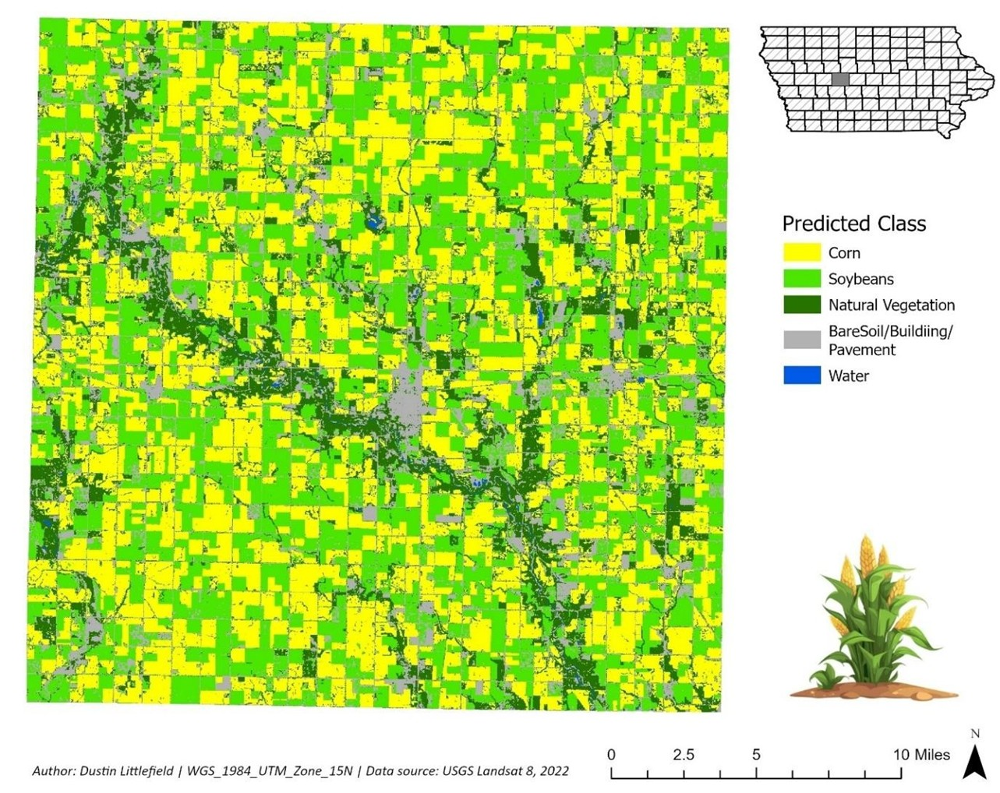

# Assessing Mid‑Season Crop Conditions in Iowa Using Supervised Classification and NDVI

**Author:** Dustin Littlefield  
**Portfolio:** https://github.com/dustinlit  
**Project Type:** `Agricultural Remote Sensing` `Crop Classification` `Vegetation Health`  
**Technologies:** `Landsat 8` `ArcGIS Pro` `NDVI` `Machine Learning` `Random Trees`  
**Last Updated:** March 2026

---

## Overview
This project evaluates mid‑season crop conditions in Greene County, Iowa using multispectral Landsat 8 imagery and two core remote sensing techniques: supervised classification and NDVI‑based vegetation health assessment. A Random Trees classifier was trained using ground‑truth crop locations to distinguish corn, soybeans, natural vegetation, bare soil/built surfaces, and water. NDVI was then used to assess crop vigor during the July 2022 peak growing season.

The workflow demonstrates how machine learning and spectral indices can support agricultural monitoring, yield assessment, and early detection of crop stress.

<figure>
  <figcaption style="font-size:0.9em; margin-bottom:8px;">
    <strong>Figure 1.</strong> July 2022, Random Trees classification of Greene County, Iowa. The county relies on an almost equal amount of corn and soybeans interspersed throughout the county, both of which are staple crops of the U.S. agriculture industry.  
    <em>Map Author: Dustin Littlefield PCS: WGS 1984 UTM Zone 15N Source: U.S. Geological Survey Landsat 8 Imagery</em>
  </figcaption>
  
</figure>
 

## Data

**Primary Data Source:** Landsat 8 Operational Land Imager (OLI)  
- Six spectral bands used: Blue, Green, Red, NIR, SWIR1, SWIR2  
- 30‑meter spatial resolution  
- Acquired July 2022 during peak crop growth  

**Training & Validation Data**  
- Ground‑truth crop locations for supervised classification  
- USDA NASS Cropland Data Layer (CDL) for accuracy assessment  

## Methodology
### Supervised Classification
- Random Trees classifier applied to multispectral Landsat 8 imagery  
- Training schema built from known corn and soybean field locations  
- Five land‑cover classes mapped:
  - Corn  
  - Soybeans  
  - Natural Vegetation  
  - Bare Soil / Built Surfaces  
  - Water  

### Accuracy Assessment
- 100 random validation points compared to USDA CDL  
- Confusion matrix generated to evaluate:
  - Overall accuracy  
  - User’s accuracy  
  - Producer’s accuracy  
  - Cohen’s Kappa  

### NDVI Analysis
NDVI was calculated using the standard formula:

<math display="block">
  <mrow>
    <mi>NDVI</mi>
    <mo>=</mo>
    <mfrac>
      <mrow>
        <mi>NIR</mi>
        <mo>−</mo>
        <mi>Red</mi>
      </mrow>
      <mrow>
        <mi>NIR</mi>
        <mo>+</mo>
        <mi>Red</mi>
      </mrow>
    </mfrac>
  </mrow>
</math>
 

Higher NDVI values indicate healthier, more photosynthetically active vegetation.  
Corn and soybean NDVI values were extracted and compared to expected seasonal norms.

## Results

### Crop Distribution
- Corn: **140,258 acres (38.3%)**  
- Soybeans: **123,601 acres (33.8%)**  
- Remaining area: natural vegetation, bare soil/built surfaces, and water  

### NDVI Crop Health
- Mean NDVI (Corn): **0.492**  
- Mean NDVI (Soybeans): **0.457**  
- Healthy corn typically peaks around **0.7–0.8** in late July  
- 2022 values indicate **moderate crop vigor**, likely influenced by:
  - Delayed planting due to wet spring  
  - Hot, dry summer conditions  

