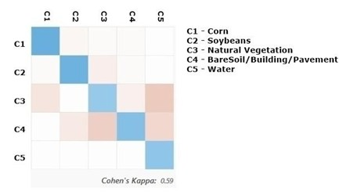
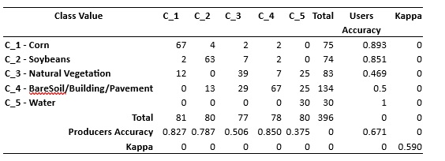
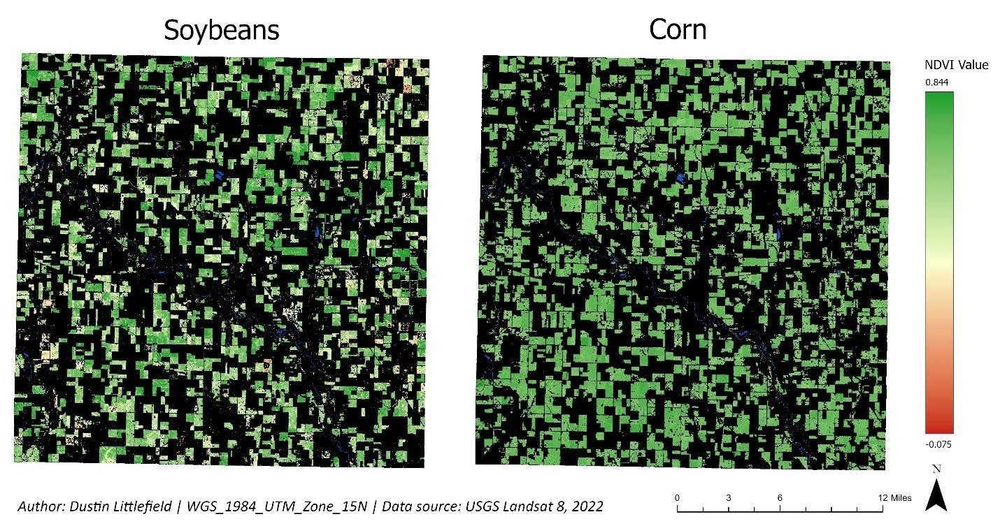
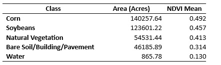

**Author:** Dustin Littlefield  
**Portfolio:** https://github.com/dustinlit  
**Project Type:** `Agricultural Remote Sensing` `Crop Classification` `Vegetation Health`  
**Technologies:** `Landsat 8` `ArcGIS Pro` `NDVI` `Machine Learning` `Random Trees`  
**Last Updated:** March 2026
 
## Introduction 
Crop modelling is an essential element in modern agriculture. It is used to limit exposure from crop losses, monitor past trends, guide future directions in crop choices, and make yield predictions for economic and food security forecasting. Crop modelling is especially valuable for regions that rely on larger acreage of fewer crop types, like corn and soybeans in the US Midwest. 
Historically, manual methods of crop modelling involve time consuming and labor-intensive field by field checking of crops. However, the availability of low cost and widely available data from satellite programs like the Landsat program have opened options for varying budgets. Remote sensing analysis provides a lower cost, quicker, and more frequent opportunity to assess and address crop health and direction. This case study presents two remote sensing methods that are commonly applied to crop modelling, spectral classification and vegetative indices.  

The objective of this project is to classify and assess the general health of corn and soybean crops in Greene County, Iowa utilizing multispectral imagery obtained from the Landsat 8 satellite. Multispectral Landsat 8 imagery is used to perform a supervised classification of the two field types and overall crop health is evaluated using the Normalized Difference Vegetation Index (NDVI). 

## Data 
The data for analysis is Landsat 8 Operational Land Imager (OLI) satellite imagery obtained from the USGS Earth Explorer website. This study utilizes 6 bands of spectral information, including the blue (B), red (R), green(G), near-infrared (NIR), shortwave infrared1 (SWIR1), and shortwave infrared 2 (SWIR2). The red and NIR bands are essential for vegetative health analysis, while the SWIR bands provide information related to general moisture levels and vegetative stress. 

The spatial resolution of the imagery is 30 meters by 30 meters. While this moderate resolution is inadequate to assess individual plants, it will be sufficient for analysis on a field scope. The imagery was collected in the summer of 2022, during the typical peak growing seasons for the crops of interest. A training schema involving known ground truth crop locations is used for the training data. Validation data was referenced from the USDA National Agricultural Statistics Service (NASS) Crop Data Layer (CDL). 

## Methodology and Results 
### Methodology 
Machine learning classification can be accomplished by two methods, supervised and unsupervised learning. The Random Trees algorithm, a supervised classification method, is used in this Greene County study. Supervised classification involves classifying individual pixels by exposing an algorithm to pixel values that correlate with verified land cover types. Supervised classification gives us more control over the result spectral classes allowing greater focus on a specific spectral area of interest for analysis, like specific crop types, and group together less needed areas. Advantages of this approach include the requirement of fewer training images and less post processing work because there is not a need to figure out the class that a classified pixel correlates with. In contrast, unsupervised classification techniques involve the algorithm statistically grouping pixel values by similarities and separating them into a number of classes that a user specifies. This method is good for exploratory research but requires a greater number of training images, additional validation data, and significantly more post processing analysis. 

### Validation 
After performing classification, it is necessary to demonstrate adequate performance. Comparison of sample points of the classification results to known ground truth data can determine how accurate the classification is. A moderate number of random points, in this case 100 pixels, are selected from the classification results and compared to the USDA CDL reference data. This process generates a confusion matrix (Figure 1), a rubric of key metrics. Overall accuracy summarizes how well the algorithm performs over all classes predicted. The user’s accuracy is a metric determining how accurately the target was identified, for example, what is classified as soybeans is a soybean field.  The producer’s accuracy indicates how well all the points in a specific class were classified; how often soybeans were misclassified.  The kappa coefficient is a metric describing how well the algorithm performed compared to random guessing. 

<figure>
  <figcaption style="font-size:0.9em; margin-bottom:8px;">
    <strong>Figure 1.</strong> Heatmap of the confusion matrix for the classification raster versus   USDA reference data. 
  </figcaption>
  
</figure>

The overall classification accuracy is relatively low at 67% because of the confusion among the spectrally diverse classes, natural vegetation and bare soil/building/pavement. These surfaces may have a mixture of pixels that may have very similar spectral signatures to the targets. The primary targets of analysis, corn and soybeans, both have a moderately high user’s and producer’s accuracy, indicating reliable identification of these items. The kappa coefficient is also moderately high, which supports that even though our overall accuracy is low there are still meaningful classifications of the target items. 

<figure>
  <figcaption style="font-size:0.9em; margin-bottom:8px;">
    <strong>Table 1.</strong> Data of the confusion matrix for the classification raster versus USDA   reference data. 
  </figcaption>
  
</figure>
								
### NDVI 
To assess crop health for this case study, the Normalized Difference Vegetation Index (NDVI) is used. Plants produce energy by using chlorophyll to absorb light specifically in the red spectrum. Unhealthy, diseased, or dormant plants will reflect more red light than healthy vegetation.  NDVI values in this study were calculated using Equation 1 (Wang, Cherkauer, & Bowling, 2016) 

<math display="block">
  <mrow>
    <mi>NDVI</mi>
    <mo>=</mo>
    <mfrac>
      <mrow>
        <mi>NIR</mi>
        <mo>−</mo>
        <mi>Red</mi>
      </mrow>
      <mrow>
        <mi>NIR</mi>
        <mo>+</mo>
        <mi>Red</mi>
      </mrow>
    </mfrac>
  </mrow>
</math>
 

By calculating the ratio of red to Near infrared, we can estimate the general productivity of a plant in a specific moment. In peak growing season, we would expect to see a larger difference in these light values as ideally more red light is being absorbed then reflected. This produces NDVI values closer to 1 and indicates healthier plants. In a diseased or dormant state, little or no energy production is taking place, causing more red light to be reflected, this causes the NDVI value to approach zero. 

## Results 
The classification in Figure 2 revealed that corn and soybean fields dominate Greene County. Acreage analysis of the predictions shows that corn is slightly more popular crop accounting for 140,258 acres (38.3%), while soybeans follow closely covering 123,601 acres (33.8%) of the county. The equal distribution of two crops in the county may help reduce economic risk from crop failure.

<figure>
  <figcaption style="font-size:0.9em; margin-bottom:8px;">
    <strong>Figure 2.</strong> July 2022, Random Trees classification of Greene County, Iowa. The county relies on an almost   equal amount of corn and soybeans interspersed throughout the county, both of which are staple crops   of the U.S. agriculture industry.  
    <em>Map Author: Dustin Littlefield PCS: WGS 1984 UTM Zone 15N Source: U.S. Geological Survey Landsat 8 Imagery</em>
  </figcaption>
  
</figure>
 

The analysis of the average NDVI of both crops of interest, .492 for corn and .457 for soybeans. Studies show that healthy corn peaks between .7 and .8 in late July to early August (Wang et al., 2016) suggesting that the vegetative health of the crops is moderate and is trailing behind the average for this time of year. The corn crops are showing slightly better health than soybeans. The conditions that may have contributed to this include delays in the planting season because of excessive springtime precipitation and difficult dry hot summer conditions.

<figure>
  <figcaption style="font-size:0.9em; margin-bottom:8px;">
    <strong>Figure 3.</strong> NDVI overlays of Sentinel‑2B images from pre‑ and post‑fire. Higher NDVI values (0.4–0.8, green)   indicate healthy vegetation, and lower values (0–0.4, pink) indicate vegetation loss or bare soil. 
    <em>Map Author: Dustin Littlefield PCS: WGS 1984 UTM Zone 15N Source: U.S. Geological Survey Landsat 8 Imagery</em>
  </figcaption>
  
</figure> 

<figure>
  <figcaption style="font-size:0.9em; margin-bottom:8px;">
    <strong>Table 2.</strong>  Mean NDVI and area by land cover class  
  </figcaption>
  
</figure>

These results can aid decision making on both the county and individual farmer levels. County planners can adjust future agricultural planning utilizing overall yield predictions and crop quantification. A regular dashboard can provide seasonable reports to farmers about field conditions helping them adjust irrigation schedules, identify and address infestations or disease states, and monitor new fertilization and planting strategies. 

## Conclusion 
This project represents my first exposure to utilizing machine learning methods in a remote sensing application to classify vegetation and examine vegetative health. This improved my understanding of how classification techniques, supervised and unsupervised, are used for agricultural classification. Living in a diverse agricultural region, I believe these skills will be extremely valuable in my future analysis work. The most challenging portion of the module was drafting the presentation and interpretation of results in context of delivery to an agricultural board. Although I understand the methods on a technical level, it has become apparent that I need to dedicate time to developing strategies for effective communication of processes and results to wider audiences. I also struggle with the presentation of technical maps balancing aesthetic appeal with technical accuracy. 

## References 
Wang, R., Cherkauer, K., & Bowling, L. (2016). Corn response to climate stress detected with satellite-based NDVI time series. Remote Sensing, 8(4), 269. https://doi.org/10.3390/rs8040269 
